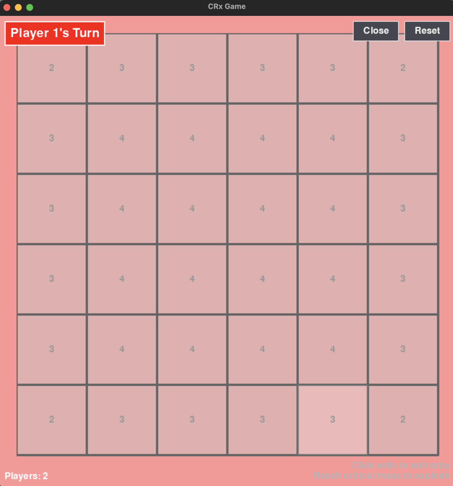
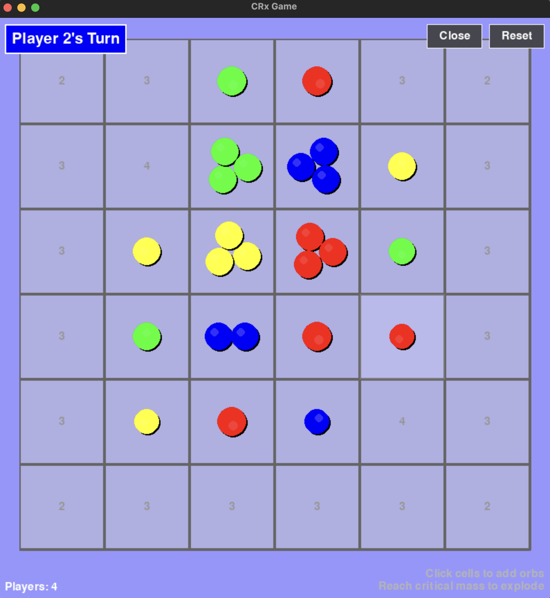
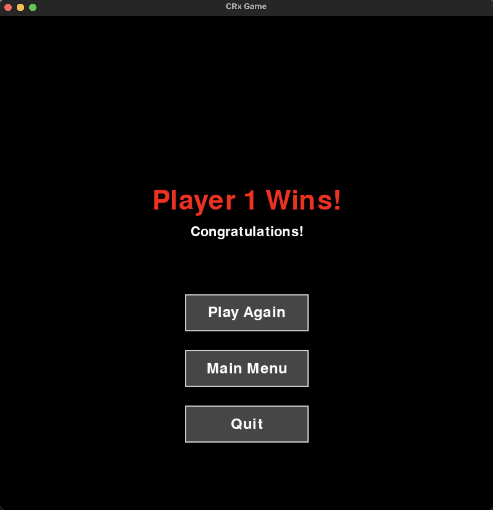
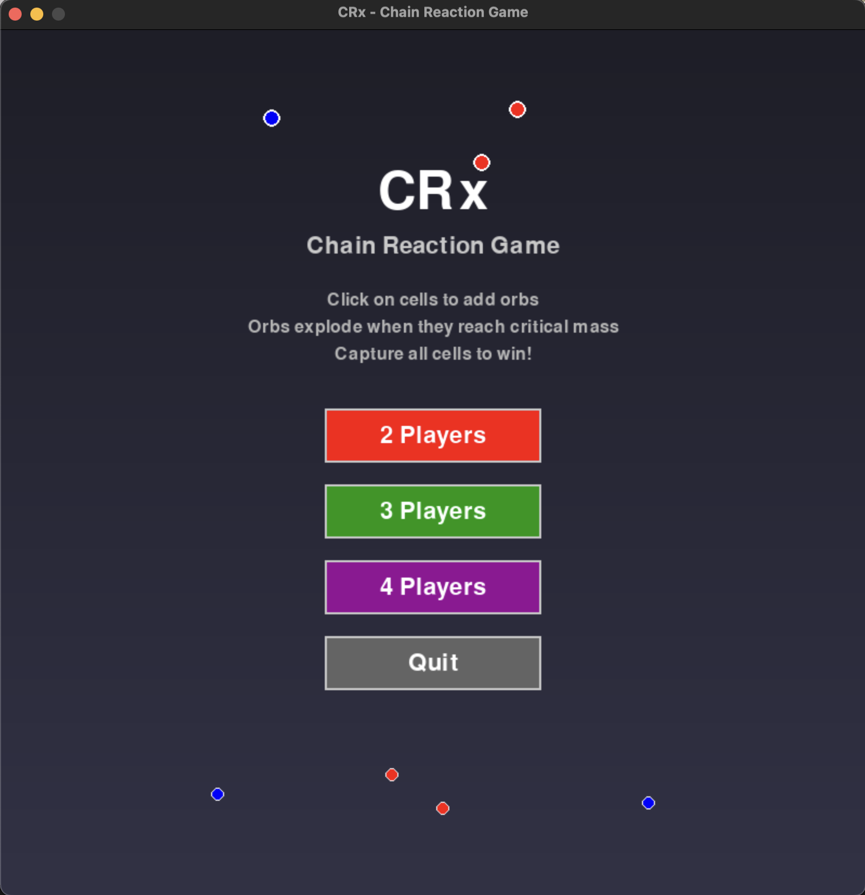

# CRx Game Open Source

A Python implementation of the CRx game using Pygame. This is a strategy game where players take turns placing orbs on a grid, trying to eliminate their opponents' orbs.

## Quick Preview
<p align="center">
  
  
  
  
</p>

## Game Features

### Core Gameplay
- Strategic turn-based gameplay on an 8x8 grid
- Multiple player support (2 or more players)
- Dynamic orb placement and chain reaction mechanics
- Real-time animations for explosions and orb movements
- Responsive UI that adapts to window resizing

### Visual Elements
- Color-coded players with distinct orb colors
- Dynamic background color changes based on current player
- Smooth animations for:
  - Orb placement
  - Explosion effects
  - Chain reactions
- Grid highlighting for valid moves
- Player turn indicators

### Game Mechanics
1. The game is played on an 8x8 grid
2. Players take turns placing orbs on the grid
3. You can only place orbs in empty cells or cells containing your own orbs
4. Each cell has a critical mass:
   - Corner cells: 2 orbs
   - Edge cells: 3 orbs
   - Inner cells: 4 orbs
5. When a cell reaches critical mass, it explodes and distributes orbs to adjacent cells
6. The game continues until one player is eliminated

### Win Conditions
- Elimination: Last player with orbs remaining wins
- Domination: Player who controls all cells with orbs wins
- All players must have at least one turn before a win can be declared

### User Interface
- Player turn indicator showing current player
- Game information display (number of players)
- Control instructions
- Reset and Close buttons
- Game over screen with:
  - Winner announcement
  - Play Again option
  - Return to Menu option
  - Quit option

## Project Structure

```
.
├── requirements.txt
├── README.md
├── run_game.py      # Main entry point script
├── src/
│   ├── __init__.py
│   ├── constants.py    # Game constants and configuration
│   ├── cell.py        # Cell class implementation
│   ├── game.py        # Main game logic
│   ├── menu.py        # Game menu implementation
│   ├── game_over.py   # Game over screen
│   ├── animations.py  # Animation system
│   └── ui_components.py # UI elements
└── main.py           # Game initialization
```

## Installation

1. Make sure you have Python 3.12+ installed
2. Create a virtual environment (recommended):
   ```bash
   python -m venv venv
   ```
3. Activate the virtual environment:
   - On Windows:
     ```bash
     venv\Scripts\activate
     ```
   - On macOS/Linux:
     ```bash
     source venv/bin/activate
     ```
4. Install dependencies:
   ```bash
   pip install -r requirements.txt
   ```

## Running the Game

1. Make sure your virtual environment is activated
2. Run the game:
   ```bash
   python run_game.py
   ```

## How to Play

- Click on a cell to place an orb
- Players take turns automatically
- The current player's color is shown in the orbs and background
- Try to eliminate your opponent's orbs by creating chain reactions
- Watch for chain reactions that can turn the tide of the game
- Plan your moves strategically to control the board

## Controls

- Left click: Place an orb
- Reset button: Start a new game with same settings
- Close button: Return to main menu
- ESC key: Return to main menu (during game over screen)
- Enter key: Play again (during game over screen)
- Close window to exit

## Debug Mode

The game supports a debug mode that can be enabled by running:
```bash
python run_game.py --debug
```

Debug mode will:
- Log game events to a timestamped file in the `logs/` directory
- Track game state changes
- Monitor player moves and orb counts
- Record win conditions and game outcomes

## Contributing

We welcome contributions to improve the CRx Game! Here's how you can contribute:

### Development Workflow

1. Fork the repository
2. Create a new branch for your feature/fix:
   ```bash
   git checkout -b feature/your-feature-name
   # or
   git checkout -b fix/your-fix-name
   ```
3. Make your changes
4. Test your changes thoroughly
5. Commit your changes with clear commit messages
6. Push to your fork
7. Create a Pull Request

### Branch Naming Convention

- Feature branches: `feature/feature-name`
- Bug fixes: `fix/bug-name`
- Documentation: `docs/description`
- Performance improvements: `perf/description`

### Code Style

- Follow PEP 8 guidelines for Python code
- Use meaningful variable and function names
- Add comments for complex logic
- Write docstrings for functions and classes
- Keep functions focused and single-purpose

### Testing

- Test your changes thoroughly
- Add new tests for new features
- Ensure all existing tests pass
- Test on different platforms if possible

### Contact

For any questions, suggestions, or to discuss potential contributions, please contact:
- Email: mhdaliharmalani.work@gmail.com

### Pull Request Process

1. Update the README.md with details of changes if needed
2. Update the documentation if you're changing functionality
3. The PR will be merged once you have the sign-off of at least one maintainer
4. Make sure all tests pass before submitting

### Code of Conduct

- Be respectful and considerate of others
- Be patient and welcoming
- Be thoughtful
- Be collaborative
- When disagreeing, try to understand why

## Screenshots

### Game Interface

*The main game interface showing the 8x8 grid, player turn indicator, and game controls*

### Gameplay

*Example of gameplay with multiple players and chain reactions*

### Game Over Screen

*The game over screen showing the winner and available options*

### Menu Screen

*The main menu where players can start a new game*

> Note: To add your own screenshots, place them in the `screenshots/` directory and update this section accordingly. Screenshots should be in PNG format and should showcase different aspects of the game.
